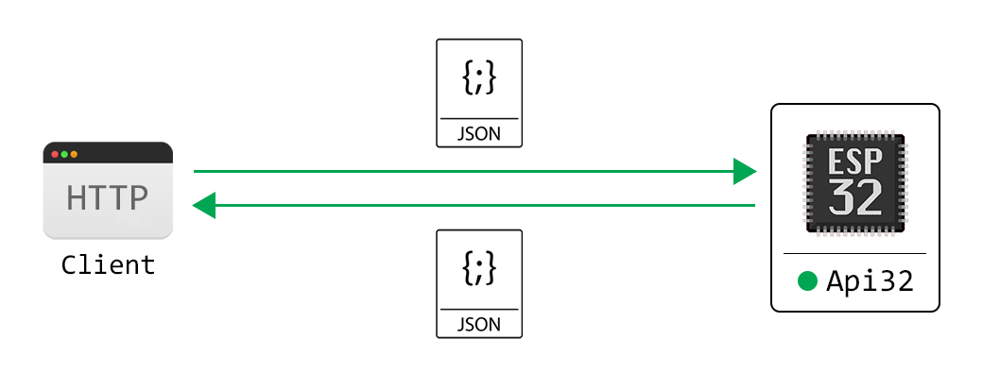

# Api32
Lua library for simple way of creating JSON APIs for ESP32.

Api32 is HTTP Server and JSON REST API - in one.



## Demo
[](https://www.youtube.com/watch?v=HhT2ixEH4cU)

## Usage
### Registration of `GET` endpoint
To register `GET` endpoint, use the `on_get` method.
```lua
require('api32')
.create()
.on_get('/info', function(jreq) 
	return {
		message = 'Hello world'
	}
end)
```

By sending HTTP `GET` request to previously created `info` endpoint (e.g. 192.168.0.32/info), `Api32` will process the received HTTP request, and return next `JSON` as response back to the client (web browser):
```json
{ "message" : "Hello world" }
```

### Registration of `POST` endpoint
To register `POST` endpoint, just use the `on_post` method, instead of `on_get`.
```lua
require('api32')
.create()
.on_post('/config', function(jreq) 
	return {
		message = 'Congrats! You have successfully accessed the POST endpoint.'
	}
end)
```

By sending HTTP `POST` request to `/config` endpoint, the next `JSON` response will be returned:
```json
{ "message" : "Congrats! You have successfully accessed the POST endpoint." }
```

### Serving static file

To serve a static file with `Api32`, instead of handler function, you need to provide filename.

```lua
api = require('api32')
.create()
.on_get('/', 'index.html')
```

## Security
Api32 implements [Basic HTTP Authorization](https://en.wikipedia.org/wiki/Basic_access_authentication). To enable Authorization, property `auth` of options table, needs to be passed to the `create` method.
```lua
require('api32')
.create({
	auth = {
		user = 'my_auth_username',
		pwd  = 'my_auth_password'
	}
})
.on_get('/', function(jreq)
	return {
		message = "I'm secured!"
	}
end)
```

## Dependencies
The library depends on the following NodeMCU modules:
  - `sjson`
  - `encoder`
